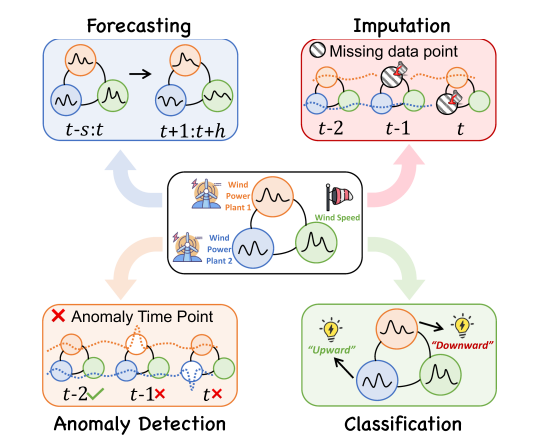

**时间序列分析概念：**记录动态系统测量，主流基于图神经网络GNN（学习非欧几里德数据表述）的时间序列，本质时空。

**主要研究内容：**GNN4TS包括四个维度，预测（预测时间序列未来值），分类（分配分类标签），异常检测以及插补（估计和填写时间序列中缺失或不完整的数据点）

**序列数据定义：**定期、不定期、单变量、多变量      动态时间与变量间以依赖，时间与序列间依赖

数据缺失图结构：基于启发式的图（图形结构间接近度）    基于学习的图（直接从数据中学习图结构，并与下游任务进行端到端的学习）

统一方法框架：空间模块来模拟时间序列间的依赖关系，并且分为光谱GNN，空间GNN以及混合，直接设计定位到每个节点领域滤波器。空间模块解释时间序列依赖性，包括基于递归，卷积，注意力，傅里叶变换。

预训练，转移学习以及大型模式是未来性能提升的有效策略。以及稳健性，隐私问题。

**总结：**

对于时间序列的主要任务的明确，包括预测，异常检测，分类以及插补四项，以及各类别的主要研究方法，总体结构的简单模型，未来的可供研究方向。
