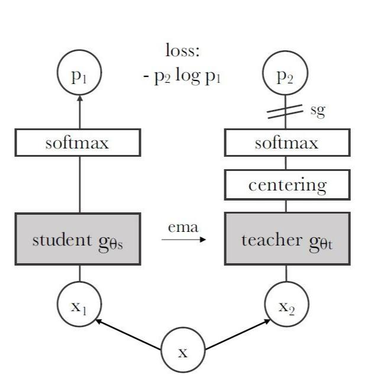

背景：Vision Transformer被证实可用于视觉任务，但VIT对算力要求更高，需要更多的训练数据，结果与CNN拉不开差距

动机：Transformer 在 NLP 领域取得成功的主要因素之一是使用了自监督预训练。

产生：在无标签的图像数据上通过自蒸馏的方法训练出的ViT图像编码器，使用自监督学习

DINO是自监督学习与ViT结合的开创性工作。DINO系列的自监督学习的核心框架；

特点：Self-supervised ViT得到的特征显式地包含场景布局，尤其是物体边界。这些特征是从ViT的最后一个block的self-attention模块中提取的。Self-supervised ViT得到的特征使用简单的kNN进行分类，而不是用微调和数据增强的情况下，就可以在ImageNet达到78.3%的准确率。

DINO:在无标签的图像数据上通过自蒸馏的方法训练出的ViT图像编码器，将输入图像转成patch tokens。利用DINO将每张图像切分图像块，转化为视觉嵌入向量DINO 是一个自监督学习模型，这里的作用是将输入图像分块（patchify），转化为一系列的 token，每个 token 可以理解为是每一个小 patch 的特征表述。经过处理后，每张图片都变成了一组特征向量。

### Student网络 和Teacher网络 

student和teacher在网络结构 上一模一样，只是权重不同，DINO对比学习看作是一个蒸馏的过程，student网络的输出要去对齐teacher网络的输出。

