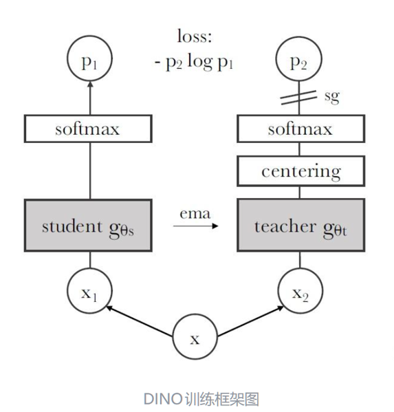
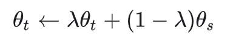
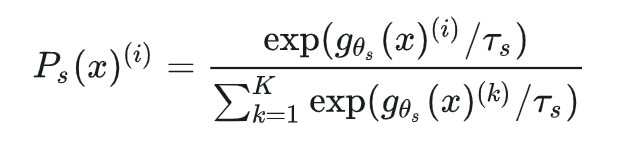
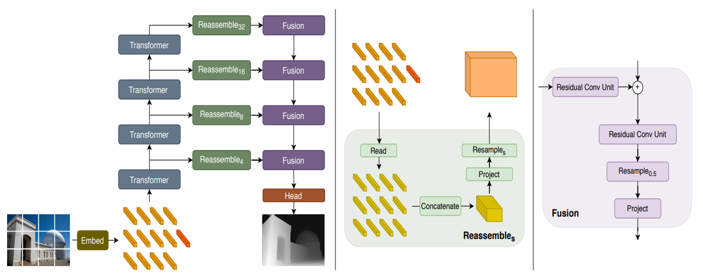

完成关于VGGT论文的深入分析，主要是补充论文主要内容以及延伸的内容，包括vggt框架中主要DINO模型。

dino模型：适用自监督学习，在无标签的图像数据上通过自蒸馏的方法训练出的ViT图像编码器。核心是student网络模仿teacher网络的输出，而teacher网络由student网络的参数滑动平均更新而来

sg符号表示梯度不会向teacher网络回传，只会更新student网络的参数

以及DPT的主要完成项目。**采用编码器-解码器结构，图像token 通过DPT层，被解码为稠密特征图，再经过卷积得到深度图D，点云图P，点追踪特征T**

在最后是vggt相关ppt完成制作。