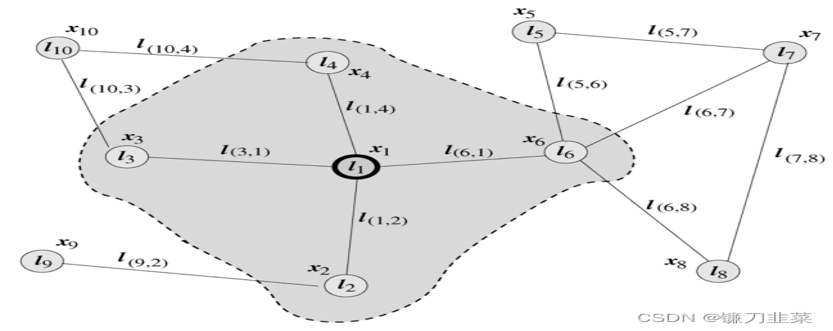
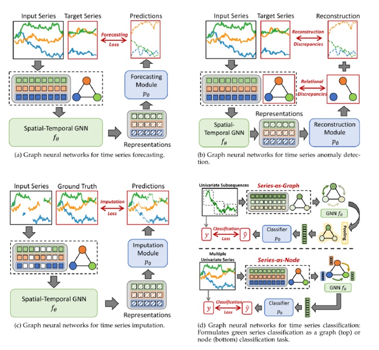

对于论文有关于时间序列综述的总体四类任务——分类，预测，异常检测，填补的完成

对于时间序列以及图神经网络的进一步文献阅读，       图数据是种复杂的数据结构，由节点和边组成，用于表示对象及其相互关系。节点代表数据中的实体，边则表示实体之间的关系

任务分类法：

处理流程：

给定一个时间序列数据集,首先使用数据处理模块进行处理, 执行基本的数据清理和标准化任务,包括提取图形结构。随后,STGNN 用于获取时间序列表示,然后将其传递给不同的处理程序，以执行各种分析任务,例如预测和异常检测。

方向和挑战

预训练、迁移学习和大型模型挑战大规模预训练的有限时间序列数据、确保广泛的覆盖范围和可转移性,以及设计捕获复杂时空依赖性的策略鲁棒性处理数据扰动和分布变化的能力，让模型在复杂、有噪声的现实环境中依然可靠。

增强隐私GNN 的可解释性虽然对于识别漏洞很有用,但也可能暴露敏感信息，解决数据安全和合规问题，是落地的红线。

可拓展性传统的GNN使用节点式 , 层式 , 和图式等采样策略来缓解大量时间相关数据的适应性问题,但保留时间依赖性仍旧很复杂。让模型能处理海量、动态的实时数据，是规模化的工程保障。