主要完善了有关于时序序列图神经网络的文献ppt

数据操作：

数据结构：N维数组，0d，1d，2d，3d

创建：形状，数据类型，元素值

元素访问：[1:3,1:]一二行，1到无穷列；[::3,::2]跳格，3行一跳，两列一跳，0与3行，0与2列

张量表示一个数值组成的数组，tensor；x.shape访问张量的形状；x.numel访问张量元素总数

改变张量形状，不改数量与元素值，x.reshape(3,4)，将数组分为3行4列

全0，全1张量创建，torch.zeros(),torch.ones()

列表创建张量，torch.tensor([[[2,3,1],[3,4,5],[1,4,7]]])

运算：

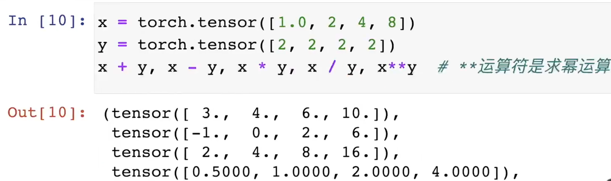

torch.cat()(x,y),dim=0)表示让x与y的张量按行拼在一起；torch.cat()(x,y),dim=1)表示让x与y的张量按列拼在一起

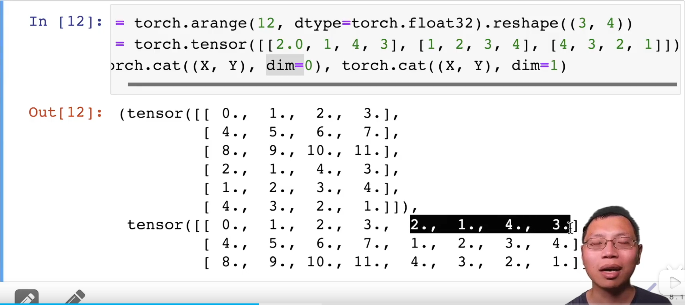

逻辑运算构建二维张量x==y

张量元素求和，x.sum（）

难点：广播机制：当x与y的形状不一样，计算时，会化为相似形状，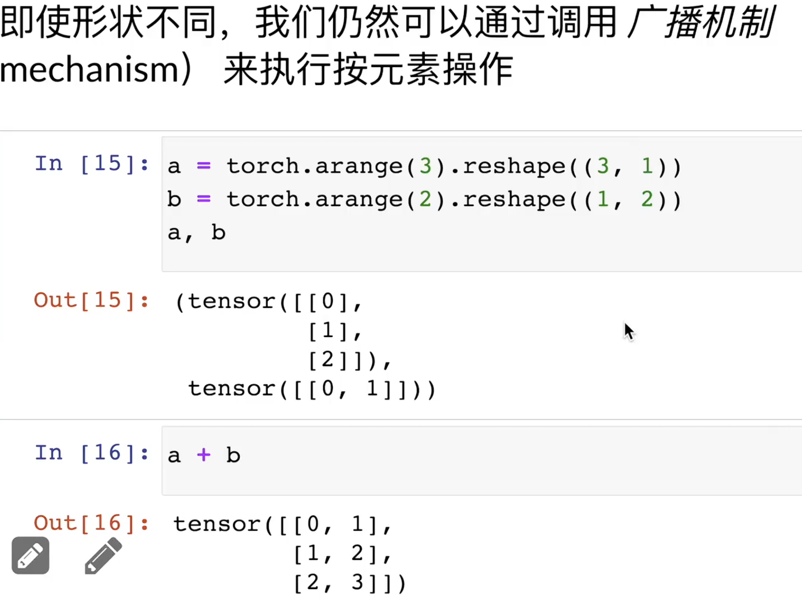

元素访问：x[-1]访问最后一个元素，x[1:3]选择第2,3元素；

元素写入：x[1,2]=9,将9替换原本位置；x[0:2,:]=12,为第1,2个元素，赋值12，并且元素中每个值都是12

防止内存爆满，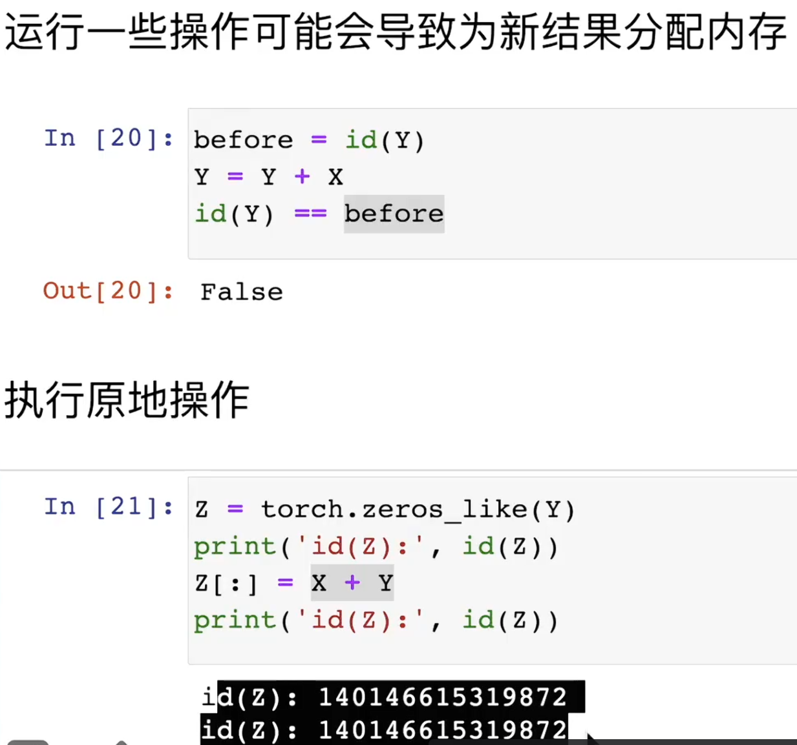

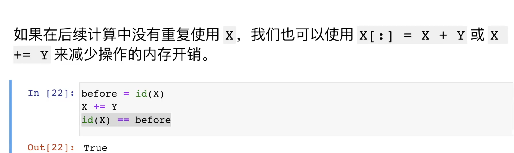

转为Numpy张量

A=x.numpy（），数据类型：numpy.ndarray

转换：

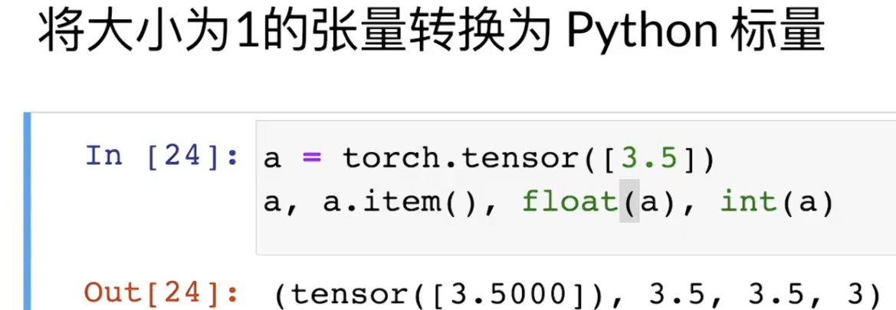

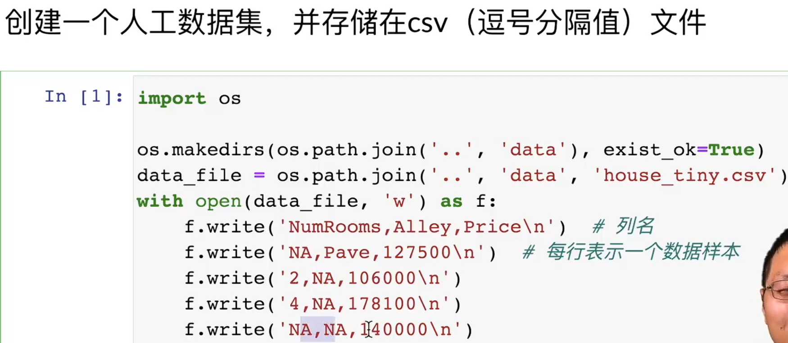

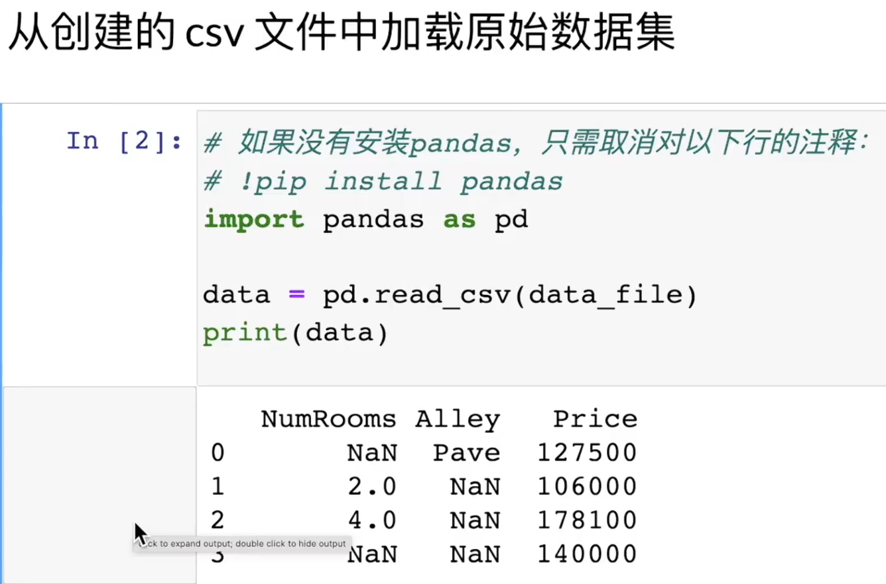

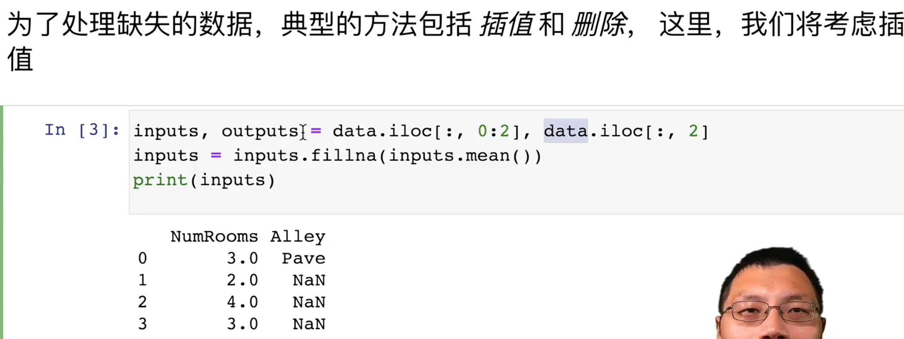

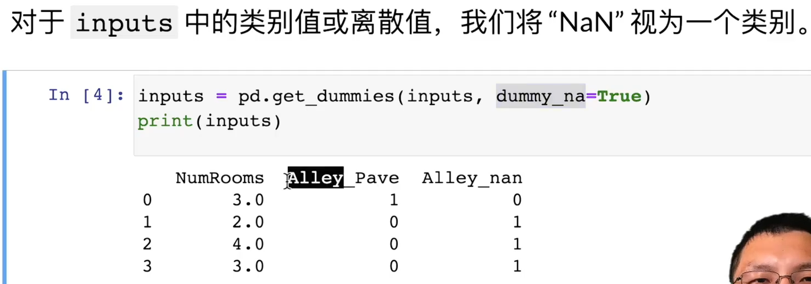

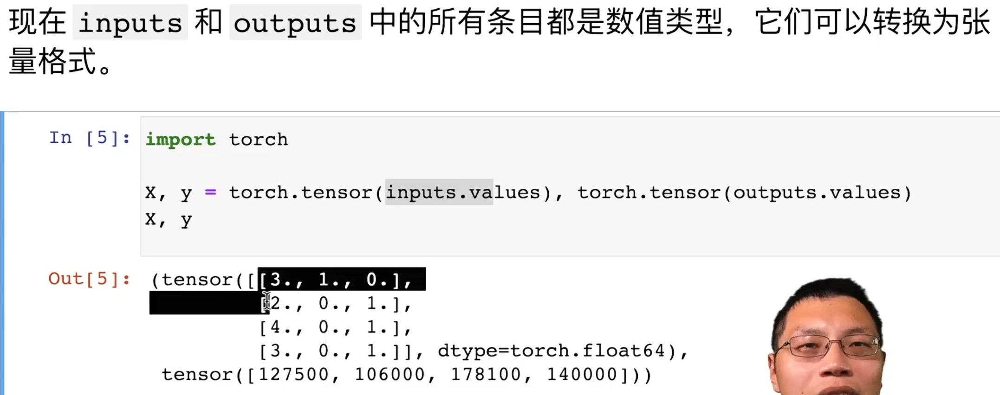

使用reshape时，将a处理后的b其实是在a的地址上，所以当把b改变，其实a也变了。