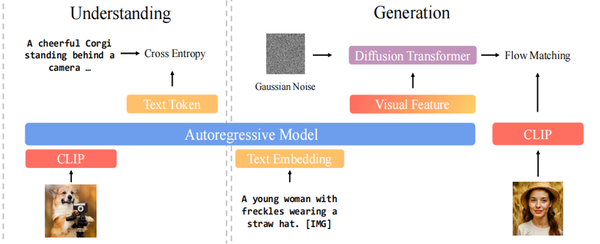
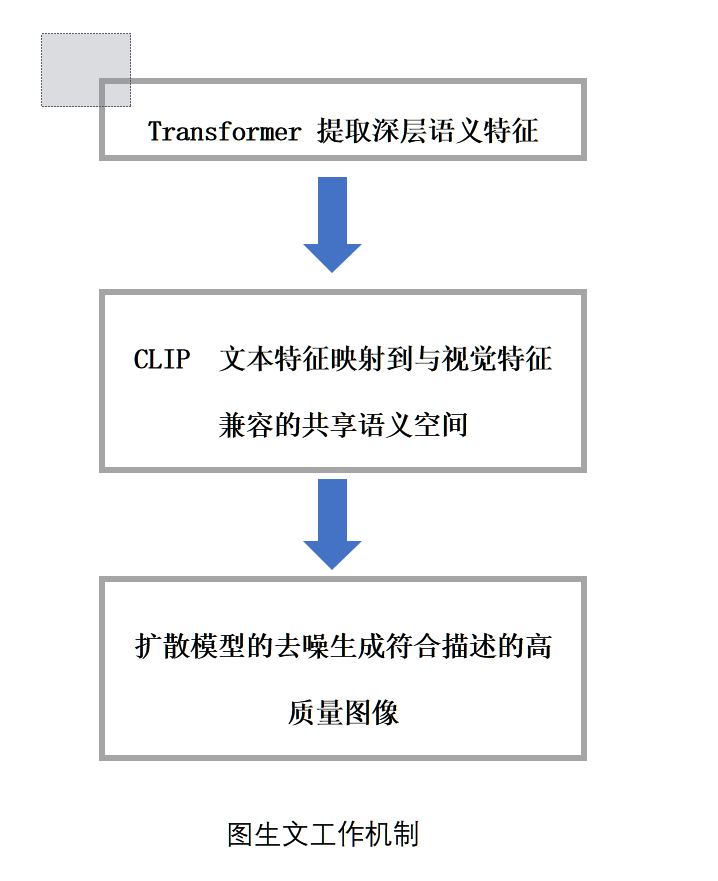
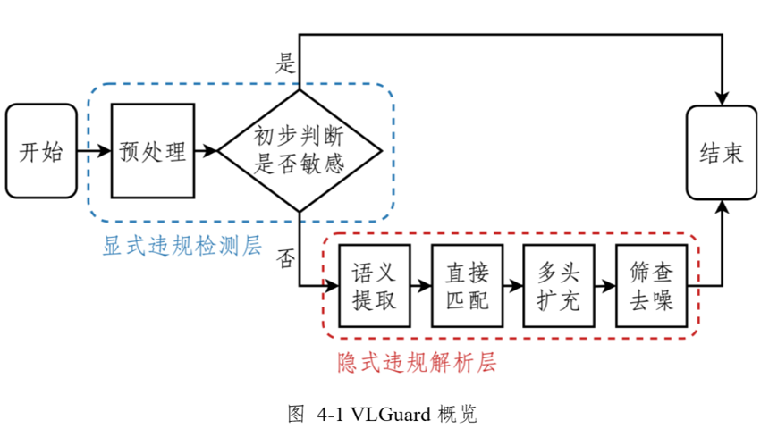
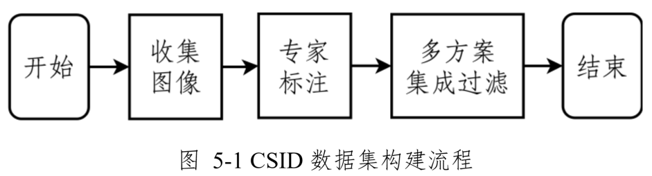

对于论文基于视觉语言大模型的  敏感图像动态审核框架的初步研读，

**研究背景与意义**

违规敏感内容泛滥，文生图发展，防护体系薄弱，敏感内容采用的表达方式模糊隐晦 ，往往通过暗示性构图、模糊边界或巧妙遮挡等方式规避平台的直接管控，或是利用平台先验知识不足的弱点。

**多模态大模型基础架构**

**文生图大模型**

**问题建模**

准确性检测应实现高召回率，防止敏感内容的流通可拓展灵活调整审查策略，对威胁的实时响应实用性保证准确率的前提下提升计算效率，约时间成本，降低资源消耗

**敏感图像动态审核框架**

利用视觉语言大模型,将非结构化的图像信息转化为机器可解析的细粒度语义单元

**隐晦敏感图像数据集及其构建方法**

管控政策的模糊性限制了内容审核的边界定义

现有检测能力与隐晦 内容的复杂性之间存在技术鸿沟

标准化评估数据集的缺失

**CSID数据集构建流程**

