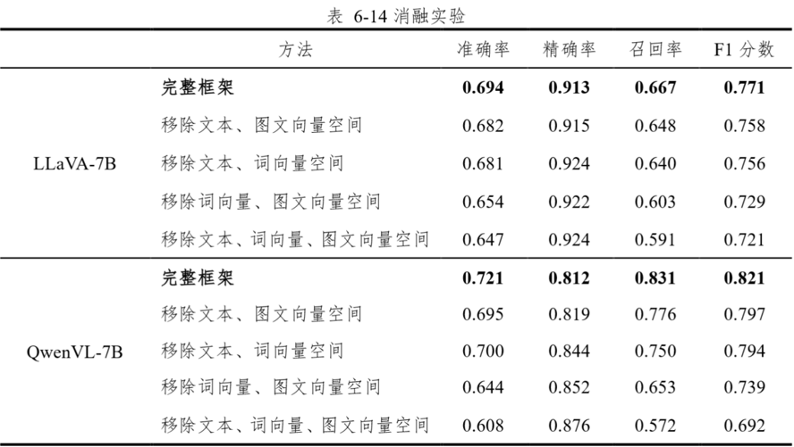

完成对于基于视觉语言大模型的零样本多标签学习方法研究的ppt完成以及更加深度的专题技术模型研读，

**敏感图像动态审核系统的实现与评估**

满足多模态数据处理能力、开源可访问性以及良好的指令遵循性。本研究选择了LLaVA、Llama3.2 Vision 和 QwenVL 三种视觉语言大模型作为实验基础

准确率：正确分类的样本在总样本中的占比精确率：敏感内容判定的准确性召回率：敏感内容的完整性F1分数：精确率和召回率的调和平均值,综合反映模型的整体性能

基准组：直接方式让视觉语言大模型对输入图像进行判断；引入了思维链技术，CoT模型会先分析图像中的对象、场景和活动,然后考虑元素与敏感内容相关；

思维树技术，ToT是CoT的扩展,探索多个可能的推理路径,整体思考形成树状结构集成过滤组：Claude 3、Llama Guard 3 Vision和网易易盾

其他现有组：NSFW_Detector，基于 CLIP 图像编码器的图片分类模型Q16，二元图像分类器，道德方面检测MultiHeaded Safety Classifier，检测色情露骨、暴力、令人震惊、仇恨和政治类图像

以及对应实验数据的分析完成

QwenVL-7B 配合本框架在暴力血腥主题识别任务中表现最为出色

QwenVL7B、Llama3.2-11B 和 LLaVA-7B 结合本框架的性能与现有最优不相上下

以模型 LLaVA-7B 为代表,在业内标准评估框架 UnsafeBench 的不同主题任务中,结合 VLGuard 后其 F1 分数最高达到 0.774,较模型基准提升了 40.966.6 个百分点。在 CSID 的不同主题任务中,LLaVA-7B 与 VLGuard 结合后的 F1 分数最高达到 0.782,较模型基准提升 14.1-42.3 个百分点,同时相比各主题中表现最优的现有方案均有显著提升