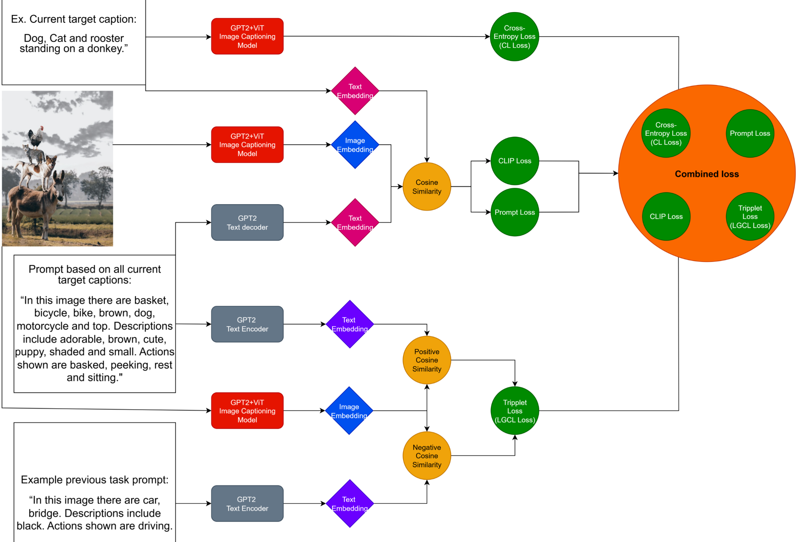
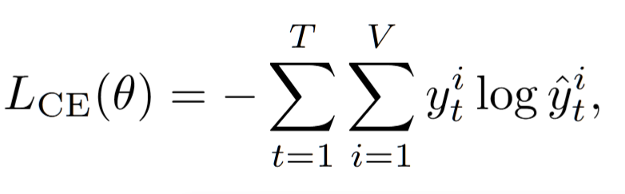
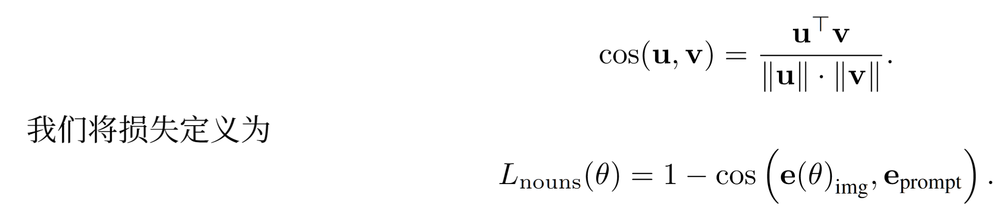
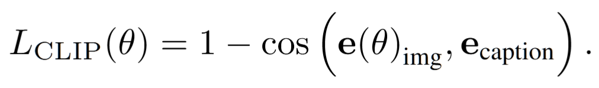
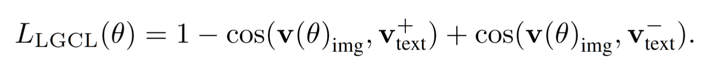
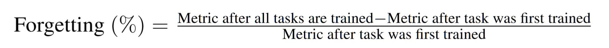
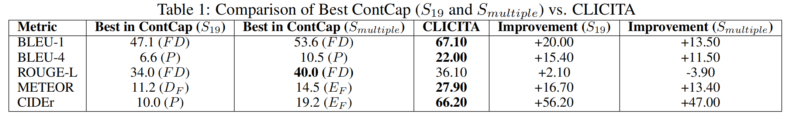
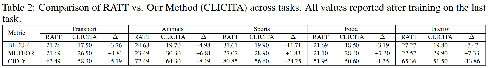
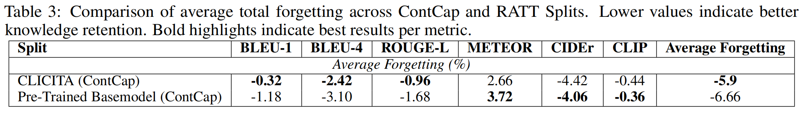
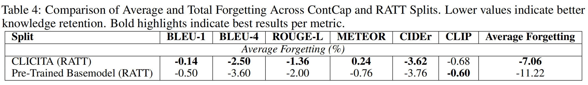

### 一、**图生文：**通过改进**图像文本对齐**来**持续学习**图像字幕

处理问题：在图生文任务解决封闭学习的持续学习中的灾难性遗忘问题

主要实现：一种用于连续图像字幕的新颖的多重损失框架，减轻灾难性遗忘,同时实现更好的语义标题对齐

#### 主要内容：四个损失函数的共同作用

1、标准交叉熵损失

2、基于**提示**的**余弦相似度**损失——图像嵌入与语义提示表示对齐

3、**CLIP** 式的余弦相似度损失——图像嵌入与目标标题文本嵌入对齐

4、**语言引导**的对比损失（基于三元组的余弦相似性）——促进跨任务的语义辨别能力

##### 重要优势：

不会产生推理时间开销，对于资源受限环境中的使用者友好

##### 相关工作：

​        针对于灾难性遗忘，持续学习提出几类方法，基于正则化、基于重放、基于优化、基于表示、基于架构。

其中，基于表示之中的**基于提示**的方法最新，利用预先训练的模型和可学习的提示, 综合自然语言处理的迁移学习思想

#### 方法公式：

##### 符号：

任务序列表示为 D = {D1, D2, . . . , DT }         Dt 由元组 (xtk, ytk) 组成

xtk ∈ X 表示任务 t 中RGB颜色空间中的输入图像 k 

 ytk ∈ Y 表示与任务 t相关联的相应标签

词汇表，使用预训练的 GPT‐2 分词器，确保了与 GPT‐2 架构的兼容性

##### 方法框架：

​       

使用四个监督信号进行优化：标准交叉熵损失、基于提示的余弦相似度损失、基于 CLIP 的余弦相似度损失和语言引导对比损失。

##### 标准交叉熵损失——使模型从图像编码中生成语言连贯且上下文适当的标题

T 是真实标题中的单词数量, V 是词汇量大小, yti是位置 t 处真实目标的二进制指示符

^yti = pθ(yt = i|y1:t−1, I) 是位置 t 处第 i 个词汇项的模型预测概率

给定图像 I、模型权重 θ 和 之前的单词(y1:t−1)

##### 基于提示的余弦相似性损失——确保视觉编码器生成的嵌入在语义上与场景中关键实体的语言基础表示一致

标准化图像和提示嵌入分别表示为 e(θ)img 和 eprompt

##### 基于 CLIP 的余弦相似度损失——促进了共享语义空间中视觉和文本模态之间的对齐

归一化图像和目标标题嵌入分别表示为 eimg 和 ecaption

##### 语言引导的对比损失——进一步增强了模型的判别能力

主要以三元组损失为基础

v(θ)img 为图像的嵌入,v+  text 为肯定提示或标题的嵌入(源自当前任务/名词提示),v−  text 为否定提示的嵌 入

#### 实验

使用标准图像字幕指标评估了模型的性能，BLEU , ROUGE CIDEr以及METEOR ，并且METEOR 在句子级别上跟踪语义一致性特别好，遗忘导致的性能损失比例：

#### 方法对比：

**各模型对比：**

CIDEr、METEOR 和 BLEU‐4 ,表明 CLICITA 显着提高了生成字幕的相关性和流畅性。虽然 ROUGE‐L 稍微落后于最好的 ContCap 变体。

**RATT 分割的任务**

CLICITA 报告所有任务的 BLEU‐4 和 CIDEr 得分较低,这表明 n 元语法精度略有下降。即使如此，METEOR 上始终优于 RATT。这表明 CLICITA 生成的字幕具有更好的整体意义对齐和语言流畅性

#### 实验结果

**遗忘分数：**

引入五类对象，观测知识保留，即平均遗忘分数，值越低越好，粗体更好

知识保留率高于预训练基础模型

**RATT数据集分割**

五个不同任务，首先过滤包含相关类别的图像,删除任务之间的重复项，保留前 5 个标题，验证集进一步按 50/50 分成验证集和测试集

##### 结论：

新型框架提供了更好的知识保留,平均遗忘率更低，特别是在解决语义一致性的指标

未来方向：在更强大、更鲁棒的模型以及更大的持续学习图像字幕数据集上探索

### 自我学习：

本文主要针对于图像字幕的持续学习，解决灾难性遗忘的问题，创建多重损失框架，主要内容是四个损失

针对于框架结构分析

系统同时接受四种输入，真实标签（目标的描述），视觉输入（描述图像），当前任务提示词，历史任务的提示词

提取多个特征去计算，形成4个损失函数，然后四个损失函数共同作用训练模型

1、**交叉熵损失 (CL Loss)**：最基础的图像描述损失。作用是确保生成的**描述文本**在语义上完全匹配真实内容

2、**Prompt 损失 (Prompt Loss)**：计算**当前图像**与**当前任务**的**余弦相似度。引导模型学习更好地将特定的任务提示词与图像特征对齐

3、**CLIP 损失 (CLIP Loss)**：将**图像嵌入**与**当前目标文本**进行对比对齐。让视觉特征和文本特征落入同一个统一的语义空间

4、**三元组损失** ：强制模型**优先识别当前的新任务特征，同时将旧任务的特征向量向后移**。模型在更新参数适应新任务时，就不会**冲垮旧任务的权重，从而有效防止了灾难性遗忘**。