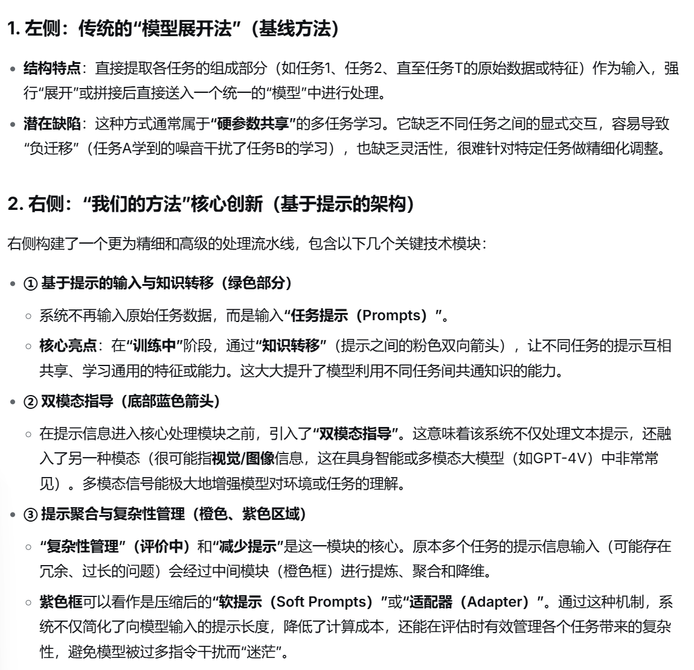
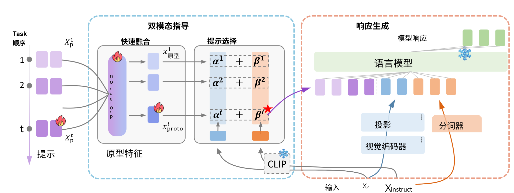
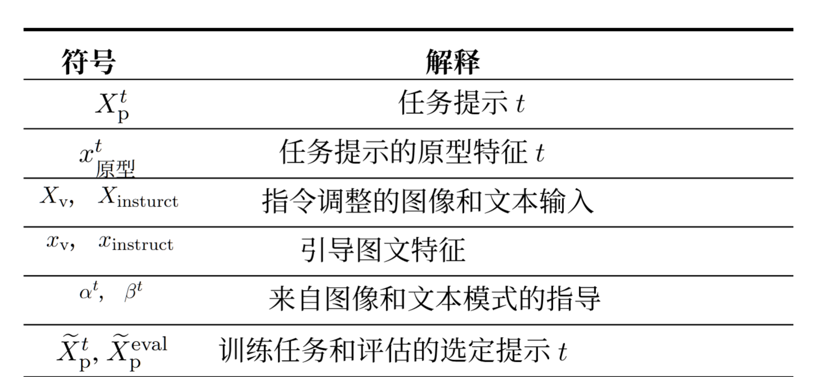
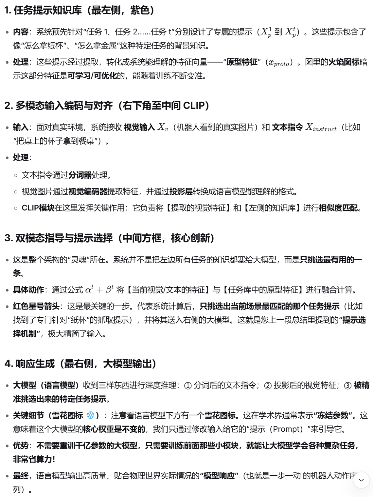
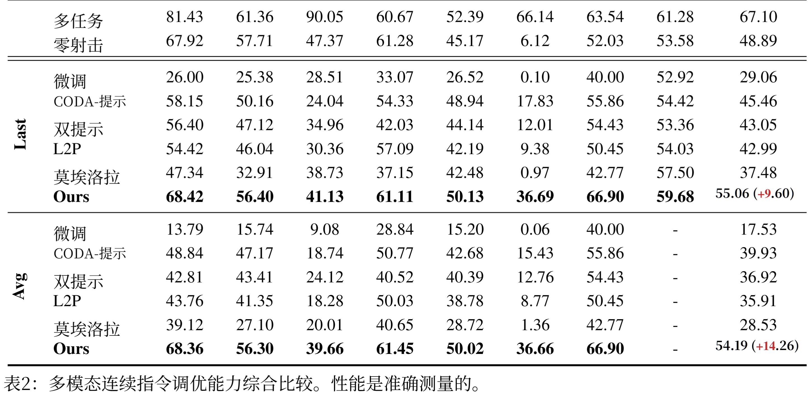
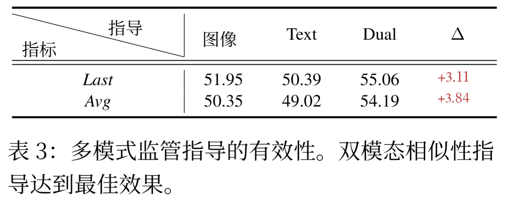
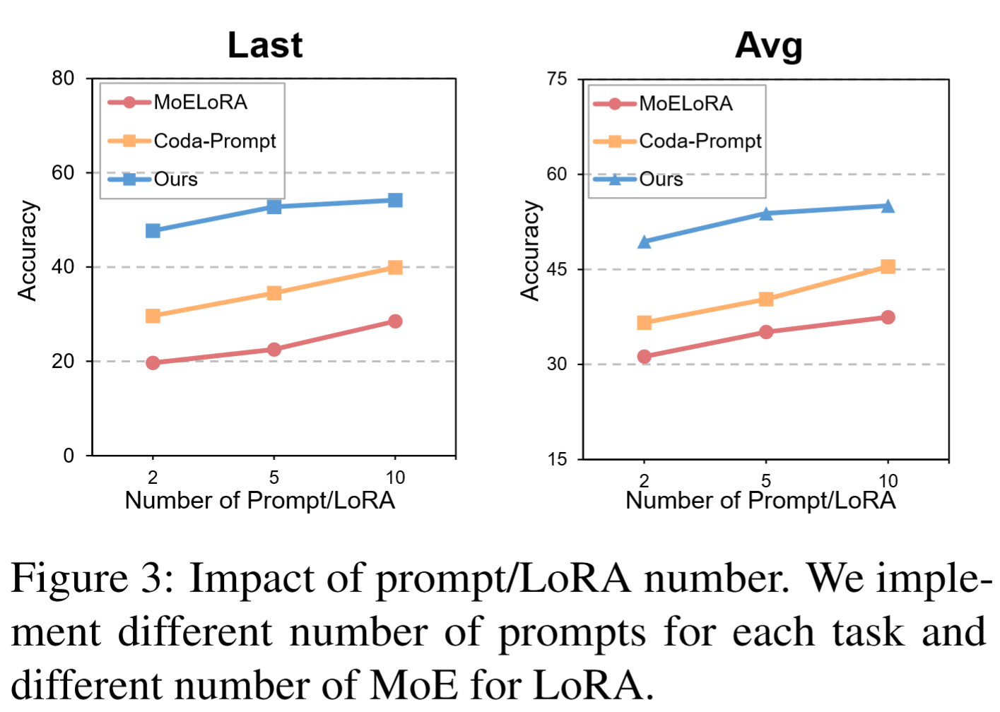
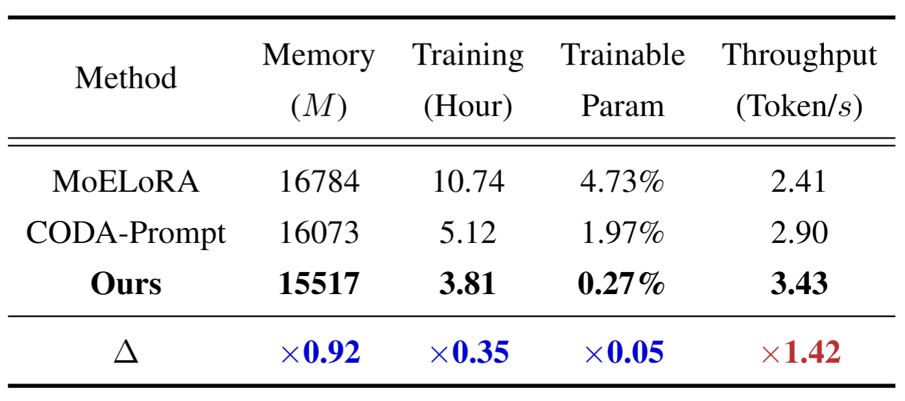
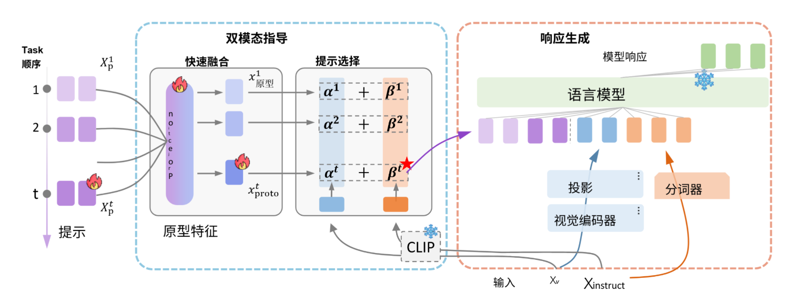

#### 二、图生文、通过双模态引导提示实现高效的多模态连续指令调优

本文主要是处理持续学习中遇到的灾难性遗忘问题以及计算复杂性两个方面

任务之间的关系链接，减弱孤岛效应

**现有方法主要解决方法：**

单独的轻量级组件不断扩展模型，造就推理过程负担

**主要问题：**

我们能否建立一个专为 LMM 设计的有效 MCIT 框架,避免不断增长的计算扩展?

- **LLM（大语言模型）：** 只能处理**纯文本**输入（如：GPT-3.5、基础版的 GPT-4）。
- **LMM（多模态大模型）：** 可以直接处理**多种模态**的输入，包括**图像、视频、音频**，并混合文本进行联合推理（如：GPT-4V、GPT-4、Claude 3、Gemini）。

**主要工作方式：**

一、建立了一个通用的即时学习框架,用于在多模态监督下进行多模态连续指令调整

​        1、为每个任务建立了提示，并且能够从提示中利用轻量级投影层提取原型特征（比如针对于不同物体的夹取任务所采用的方案的隐射）

​       2、比如利用yolov8去获取当前的空间，物体位置状态（多模态提取）然后将这些特征去和提示的特征匹配）

​       3、确认任务与提示，匹配成功，然后开始进行信息融合去完成任务

​       4、对于提示库中匹配度低的去除，只把最为相关的提供给最终大模型

**优势：**

指导特征自然地对齐多模态信息,并且毫不费力地指导 LMM的知识转移和选择

计算复杂度与任务数量以外的令牌数量成正比

证实：模型极大地提高了旧任务的性能, 并通过出色的训练和推理效率减少了遗忘

**贡献：**

一、提出ModalPrompt,这是第一个用于多模式持续指令调整的提示学习框架, 以利用多模式监督的优势来减少遗忘

二、构建提示来保留特定任务的知识,并利用有效的双模态引导提示融合和选择技术来确保 MCIT 能力,同时管理计算复杂性

三、对持续指令调优基准进行了广泛的实验

#### 相关工作

CLIP 图像编码器处理图像像素,使用线性投影仪对齐特征，自回归方式生成图像文本表示串联的响应

**参数高效调整的方法**

适配器学习、提示学习和LoRA

**持续指令调优超越了指令调优**，但目前主流方法侧重于从语言任务中迁移CIT方法，忽视针对视觉特征。coin解决这一问题但是性能严重下降

给定 一组提示 Xpt ,长度为 M ,附加到每个任务 t,  t ∈ {1, · · · , T } 以MCIT的形式表示特定于任务的知识

对于当前任务的每个输入中的图像 Xv 和文本 Xinstruct , 考虑到CLIP很好地捕获了图像文本特征,我 们重用CLIP中现成的视觉和文本编码器来提 取特定输入的多模态特征:

### **训练**    多任务PromptFusion

通过多任务提示融合在训练过程中转移旧任务的相似知识，如图那样， 对于处理后的提示➕文本＋图像投影

双模态特征可以作为提示的指导线索

### **推理**   双模态提示选择

使用双模态指导来测量某些任务的图像文本分布与特定于任务 的提示之间的相似性

优势：

(1)有助于从类似任务中迁移 知识,以提高 MCIT 的表现; 

(2) 管理推理速 度,因为时间复杂度与除任务数量之外的所选 提示数量成正比

### 实验

LLaVA 作为基础 LMM

数据集采用 CoIN

评估指标：

At,i(i ≤ t) 是任务 t (T tasksinttal) 训练后任务 i 的性能。 (1)对于最 终性能评估,我们使用指标Last(对所有任务进 行顺序训练后的性能,即AT,i, i = 1, · · · , T ) 和Avg(平均性能)来测量每个数据集

我们的方法取得了显着的改进，学习不同类型的任务时,我们的方法经历了适度的性能下降，平均值几乎没有退化

### 消融实验

图像或文本信息的表现都不如所 提出的多模态策略，特别是视觉信息缺失会造成严重后果，每个机制在框架中都起着关键作用,缺少其中任 何一个都会导致性能严重下降

### 进一步分析

效率分析，附加参数、推理延迟和 GPU 内存消耗方面进行比较,以评估效率

#### 结论：

为每 个任务构建一组提示来表示特征空间中特定于 任务的知识

即时融合来增强知识转移的性能,并利用即 时选择来管理模型的计算复杂性

#### 局限性

仅保留了已学任务的知识,而无法增强未见 过的任务

#### 自我分析：

​             本文主要是针对于使用多模态模型中出现的灾难性遗忘（在处理任务时忘记了旧任务）以及计算复杂度过高（每来一个任务就有新的参数模块）的问题，创建一套**持续指令微调（MCIT）**框架，**既不忘旧知识，又绝不增加额外推理负担**

双模态，文本与视觉

第一步，建立提示，为每一个任务分别建立专属词，并且通过轻量化投影转为原型特征

第二步，当新的任务出现时，利用clip编码器，提取到当前输入图像视觉特征以及指令文本特征

第三步，计算出原型特征与输入特征相似度，选取到最为相似的提示（减少计算量），与视觉特征投影以及文本分词一同送入推理模型（模型**不是孤立训练**，而是会把**与当前任务最相似的那些历史任务的提示词（原型）也抓过来**融入训练）**显式的跨任务知识迁移**