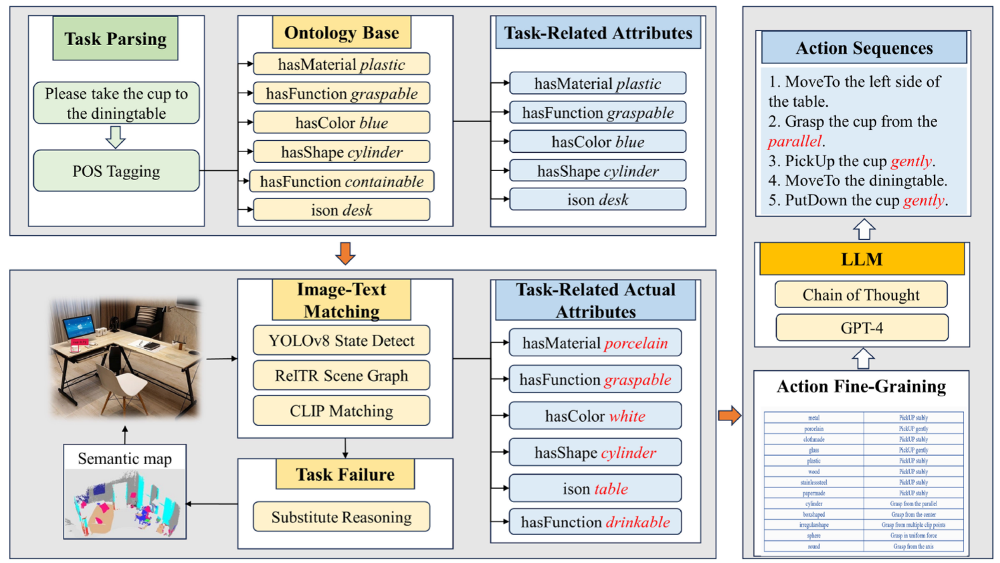
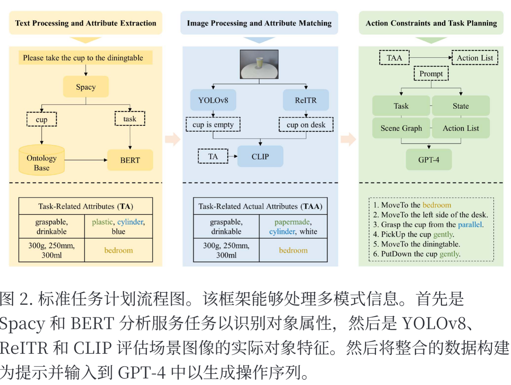
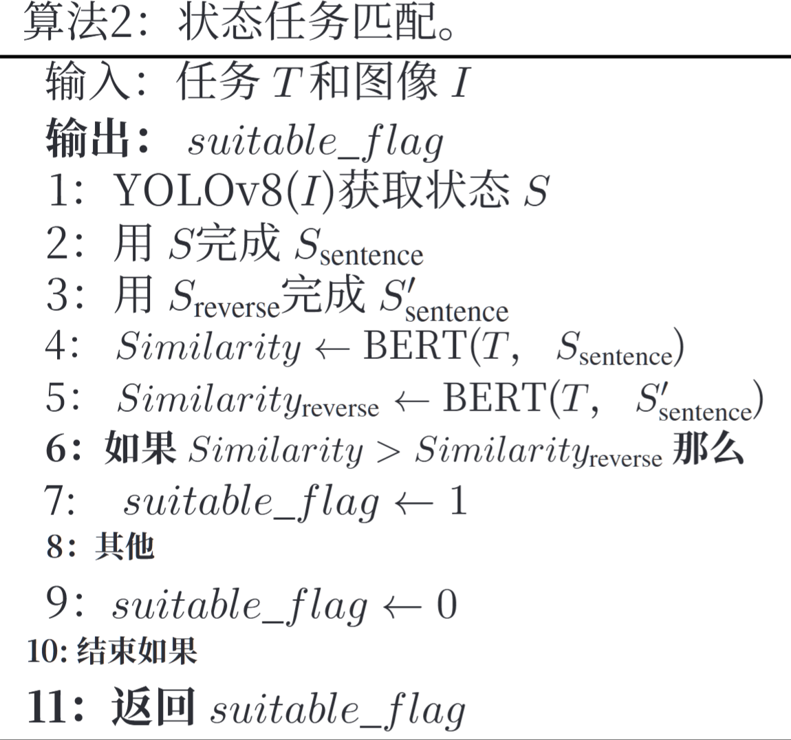
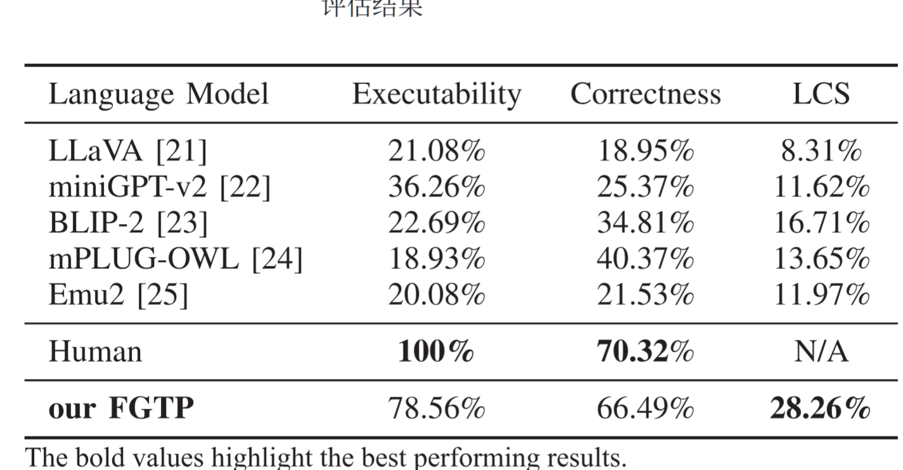
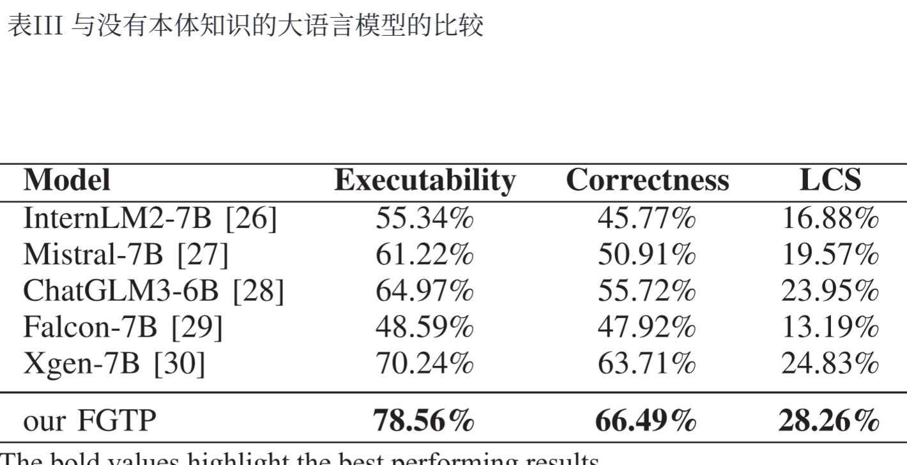
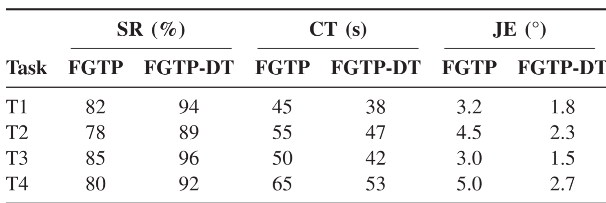

#### 基于大语言模型的对象本体知识的服务机器人细粒度任务规划

就是利用大预言模型，针对机器人任务规划之中对于任务实现的进一步提升，主要是规则外任务执行以及任务执行精度

**任务主要解决问题：**为了能够让机器人很好的完成任务，所以需要让它能够针对于特定任务需要做出特定行为。其中最为关健的是对于文本与识别图像的匹配任务

解决未知，就是不在规则库中的命令

增强细节，针对任务完成的细致度，更好完成

**主要流程：**FGTP框架主要是先去识别对象属性，然后根据属性去制定规则完成决策。在失败场景中，能够依赖于逻辑推理方法，预先语义图定位替代方案，从而过渡标准任务规划。

**传统方法缺陷：**基于规则的算法（在理想状态实现），无法充分考虑对象属性和状态对任务执行成功的关键影响

​                            基于逻辑的算法（难以考量到物体本体属性影响），llm出现，考虑动作序列的逻辑和LLM的常识（PROGPRO MPT    ，LLM‐GROP）没有考虑对象本体知识(包括状态和属性)对运动的约束

#### 挑战

基于规则的规划,缺乏**对现实场景的适应性**

基于逻辑的规划,缺乏与**对象本体知识的相关性**

********FGTP探索对象状态、属性和服务任务之间的交互。通过文本处理和图像处理********

**框架**

#### 相关工作

经典的机器人任务规划

目前方法这些元素通常特定于特定领域或任务。我们的框 架不是为特定任务而设计的,**可以推广到新任务**

基于 LLM 的机器人任务规划

**任务分为三个过程**

一、**文本处理和属性提取**

命令来深入研究服务任务解析**（对于输入文本信息提取）**

提出知识库，有六个属性—视觉、类别、物理、功能、状态和位置，**对于输入文本提取的信息进行分类**

**利用余弦相似度来评估属性与任务的相关性,从而提高任务效率**

技术：Spacy 工具包进行语义标记

​       本体知识库，提供模板

​        MySQL 数据库的结构反映了模板,有助于将类和属性映 射到 XML 标签以进行数据存储。

​        BERT模型来评估属性与任务的相关性

二、**图像处理和属性匹配**

YOLOv8去检测准确检测物体的状态

**三元组**分析对象及其关系,并将它们组织成一个以节点作为对象、边作为关系的图表

ReITR 模型 生成 详细的场景图,解释关系

CLIP  中的“VIT‐B/32”模型来将视觉属性 与任务相关对象对齐

三、**动作约束和任务规划**

(YOLOv8)的实时监控机制

GPT‐4 提示分为 六个部分:角色、任务、规则、示例、输入和注释**（执行命令）**

**动力学和时间属性的集成**

增强有用性和准确性

#### 实验

**评价指标**

可执行性——检查行动计划是否可操作且清晰，步骤逻辑（动作是否正确）

正确性——行动计划的语义精度，10 位机器人专家来审查

LCS，最长公共子序列——计划与人造示例的相似度

**FGTP框架的输入是图像和文本, 这与视觉问答(VQA)模型的输入类似,选择五个开源VQA模型作为基线与FGTP进行比较**

#### 模拟实验

参数标准

成功率 (SR),表示成功完成任务的百分比

完成时间(CT), 以秒为单位,反映任务执行的效率

关节误差(JE), 以度为单位测量,可以深入了解机器人运动的精度

四个任务

#### 真实实验

评估计划动作序列的逻辑流程和可行性

重点粒度：关键动作，复杂性

指标：

FLOP(每秒浮点运算),表明计算强度; 

(2) GPU‐Util(GPU Utilization),反映执行过程中 GPU 资源利用的百分比; 

(3)CPU‐Util(CPU Utilization), 衡量CPU资源的消耗情况; 

(4) 推理时间,跟踪处理输入 和生成输出所需的时间

与著名的开源任务规划器进行比较分析: PDDL4J和PROGPROMPT

#### 不满足要求实验

物体的状态不满足当前服务任务要求时，执行异常任务规划过程

步骤：替换推理以及对象搜索

基本原理取决于 BERT 模型计算对象状态与 服务任务之间相似度的能力,从而确定状态是否适合完成 任务

去找到替代品

#### 结论

1、FGTP框架采用双重处理策略,同时分析服务任务文本和对象图像,这对于提取指导机器人动作的任务相关对象属性至关重要

2、将本体知识库与 BERT模型相结合,有利于服务任务的细致解析和对象属性的准确识别

3、利用CLIP模型将对象属性与其图像对齐,确保对象属性确定的精度

4、包括一种基于状态检测和属性推断的新颖的重新规划方法,以解决任务规划失败并帮助持续的流程改进

**未来研究目标：**

(1)改进FGTP模型集成以获得更好的实时效率。

 (2)扩展框架对更广泛场景的适应性。

 (3) 探索使用对象图像和描述的专门数据集对预训练模型进行 微调,以提高性能和识别能力。

​     

