# 关于VLM在遥感图像方面应用文献两篇

## 一、SARLANG-1M: A Benchmark for Vision-Language Modeling in SAR Image Understanding

Yimin Wei, Aoran Xiao, Yexian Ren, Yuting Zhu, Hongruixuan Chen, Junshi Xia, Naoto Yokoya

IEEE TRANSACTIONS ON GEOSCIENCE AND REMOTE SENSING, VOL. 64, 2026

2026.1.29

High-quality texts, image captioning, synthetic aperture radar (SAR), vision-language models (VLMs), visual question-answering (VQA)

高质量文本、图像描述、合成孔径雷达、视觉语言模型、视觉问答

阅读时间：2026.9.22

代码链接：https://github.com/Jimmyxichen/SARLANG-1M

### 第一章分析文献工作的必要性

#### SAR图像成像原理以及特点缺陷

VLMs通过大规模预训练以及指令微调增强RGB图像理解上具有显著潜力。

VLMs不同于传统模型受限于固定词汇表和预定义标签，而是具有广泛开放词汇语言，支持灵活的语言交互，更直观和上下文感知的图像理解。

但是在合成孔径雷达应用困难，因为它区别于光学，而是通过微波信号，信号通过不同环境的波长表现出不同的特征，具有全天候和昼夜成像能力。所以VLM在RGB图像上的运用无法直接复制到SAR图像上。

1、SAR通过信号获取，不可避免地产生斑点噪声以及几何畸变。

2、并且语义复杂，不直观，解释具有挑战性。

3、标注复杂，需要大量的专业知识以及训练，注定成本高，多样性有限

### 第二章回顾相关工作

#### SARLANG-1M大模型基准

包含超过100万对高质SAR图像文本对，主要实现图像描述和任务问答。
支持：图像描述、目标识别、目标分类、实例计数、 区域指代和目标定位。

文本描述生成两种策略：

1、跨模态文本迁移：通过大量的RGB以及SAR图像，使用VLM模型为RGB生成高质量文本标注，并且去与对应的SAR自然对齐。并且通过人工审核过滤错误——大模型的局限，识别物体位置和定量属性不够完善

2、现有的SAR数据集检测边界框标注生成细粒度文本标注，并且与严格人工验证结合。

#### 视觉-语言任务基准

两个关键组件：

SARLANG-1M-Cap用于图像描述任务

SARLANG-1M-VQA 用于视觉问答任务

##### SARLANG-1M-Cap 强调全局级理解,  SARLANG-1M-VQA 旨在更侧重于局部内容理解

#### 图像描述的三类方法：

基于检索，基于句法模版，以及最为先进的基于编码器解码器的方法

搜索相似图像使用其标注句子生成描述；目标检测，识别候选词填充到预定义语句模板；通过视觉特征提取以及文本生成，并且可以引入特征融合模块，附加辅助目标检测等去增强特征表述。

本文献利用三个应用于配对RGB–SAR图像的代表性视觉语言模型

BLIP：使用ViT‐Large/16作为其骨干, 并在1千4百万张图像上进行了预训练

CLIP：在大型 LAION‐2B 数据集上预训练,然后在 MSCOCO上微调,非常适合开放域的视觉‐语言理解

GPT-4o：最先进的多模态大语言模型, 能够通过利用其先进的视觉‐语言推理能力生成上下文感知和详细的图像描述

BLIP和 CLIP主要生成简洁描述,而 GPT‐4o则产生更复杂和详细的描述

#### 视觉问答RSVQA

通过全面分析遥感图像的视觉内容,生成对自然语言询问的准确答案。

主要面对对于关键对象的类别、数量、特征、空间位置和目的的查询,以及不同对象之间的相对关系。

Lobry引入新的RGB-文本数据集，以及分为三个阶段的学习框架：特征提取，特征融合，基于融合的预测。

##### 语料库设计：

目标识别：对于物体存在回答是否；类别数量：回答数量；目标定位：回答上下左右

为了扩展类别，使用模态迁移方法来生成VQA标注，各种提示输入到GPT‐4o 模型中,生成了一系列的标题和问答对,增强了解释深度。

#### VLM通用架构

主流视觉语言模型包括一个预训练的视觉编码器来处理视觉数据,一个语言编码器来解释用户指令并生成响应,以及一个视觉‐语言跨模态连接器来融合视觉特征表示与文本嵌入。

预训练视觉语言模型的关键组件是通过图像‐文本对有效连接视觉和语言，主要通过

对比学习：最大化匹配相似，最小化匹配不相似来对齐图像文本对-clip

生成式建模：训练模型以生成连贯且相关的文本或图像，主要通过掩码重建和自回归预测。预测图像中遮挡块和使用先前上下文生成下一标记。

### 第三章介绍数据集构造流程

说明其来源、地理覆盖范围、传感器类型、分辨率等级和类别分布，进一步呈现了SARLANG-1M 与现有SAR解释数据集的比较分析,突出了其独特优势。

数据集来自四个公开可用的SAR数据集:SpaceNet6， DFC2023 ,  OpenEarthMap-SAR , 和SARDet‐ 100k。前三个提供RGB–SAR图像对,RGB图像无云且无雾。SARDet‐100k数据集包含SAR图像和边界框标注及其对应的类别。

概述：118331幅SAR图像,覆盖全球59多个城市，来自四个不同来源的SAR图 像,由超过12颗卫星收集，捕捉了广泛的常见遥感环境,包括机场、港口、河流、学校、住宅区、森林和商业区。

#### 与现有数据集的比较

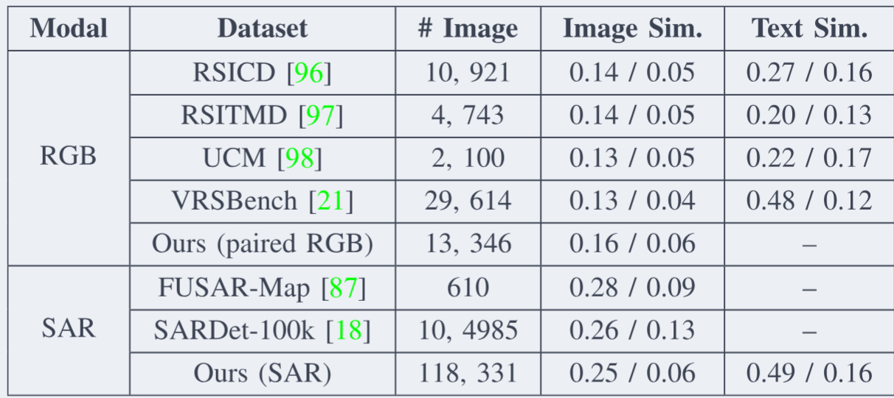

数据集的优越性提出整体相似度来量化：提供对于冗余度以及异质性描述，描述图像文本对之间的相似度，相似度越低越好

优势：提供显著更广的空间分辨率范围和更多的标注样本数量；高质量文本标注；数据集的图像相似度与包含RGB‐文本对的 mainstream 遥感数据集相当；收集的SAR图像具有更高的多样性和更低的冗余度

### 第四章VLM对于SAR评估

提出了三个用于 SAR 图像理解的 VLM 评估流程,包括零样本测试、全微调和参数高效微调

#### 零样本测试

涉及在下游任务上评估 VLM,无需任何特定任务的微调或额外训练。这种方法评估 VLM 执行 SAR 图像理解任务的通用性和鲁棒性。

#### 全微调

调整预训练视觉语言模型的全部参数,以适应新的特定数据集或任务。确保它改进其内部表示以有效捕获任务特定特征

#### 参数高效微调

通过微调一小部分模型参数,使 VLMs能够适应下游任务，分为额外参数（引入可学习参数优化模型输入层）以及内部参数微调。

##### 文献中主要采用了零样本调试以及全微调和LORA微调评估。

使用RGB图像‐文本对齐数据集的预训练参数初始化模型,并在测试集上直接评估其性能➕对每个VLM进行微调,随后在测试集上评估其性能。主要评估其在下游任务中性能的贡献。

#### 实验分析

SARLANG-1M 数据集分为两个独立的、不重叠的子集,每个子集专门用于模型训练和评估。按7:3的比例分为训练集和测试集。

评估了十个主流视觉语言模型

微调阶段,每个视觉语言模型都训练了 30 个 epoch,批大小为 1。学习率初始化为 1e−4 ,并采用 0.1 的预热策略。在这些视觉语言模型的评估过程中,SAR 图像描述任务的提示为:“用 一句话描述这张图像的内容”,而 SAR 图像问答任务的提示为:“问题: {问题}。简洁地回答问题。

#### 评估指标

SAR图像描述模型的评估：传统指标BLEU、ROUGEL、和CIDEr、以及基于GPT‐4的指标CHAIR

SAR图像VQA任务的评估：基于 GPT‐4的指标总体准确率，总体准确率计算 为匹配数量与问题总数之比

##### 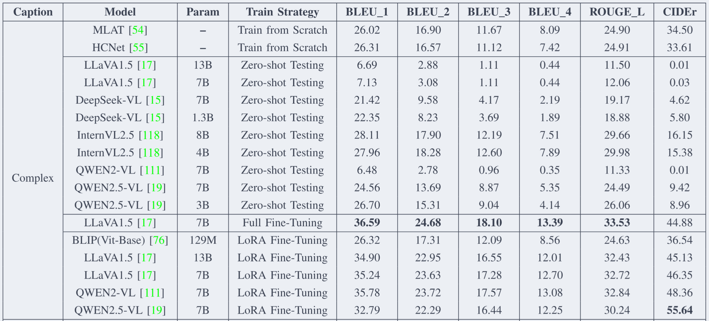

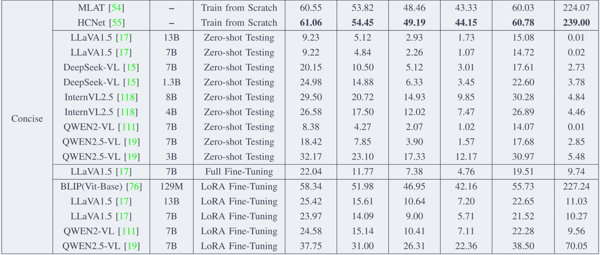

- 该基准能显著提升 VLM 的 SAR 图像描述和 VQA 能力，微调后部分任务接近甚至超过人类专家；
- 复杂描述和 VQA 是 VLM 的优势区，简洁描述因生成源偏差使传统模型和 BLIP 占优；
- 微调方式上，LoRA 高效且普适，全微调在复杂描述上表现最强；
- SAR 预处理能提供额外增益；

### 第五章总结以及限制

在SARLANG-1M上微调现有的VLMs,可以显著提升它们在SAR图像理解任务中的性能,实现与人类专家相当的解释能力。此外,SAR图像预处理策略有效地增强了VLMs在SAR图像解释方面的能力。

第一个限制涉及数据覆盖范围——扩大数据集的地理和主题多样性可以进一 步提高其代表性和泛化能力

第二个限制涉及SAR图像的极化多样性——纳入更多地理和物理 上多样化的SAR数据

#### 补充-图像相似性计算公式

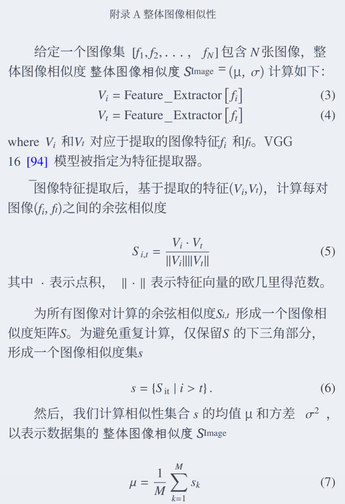

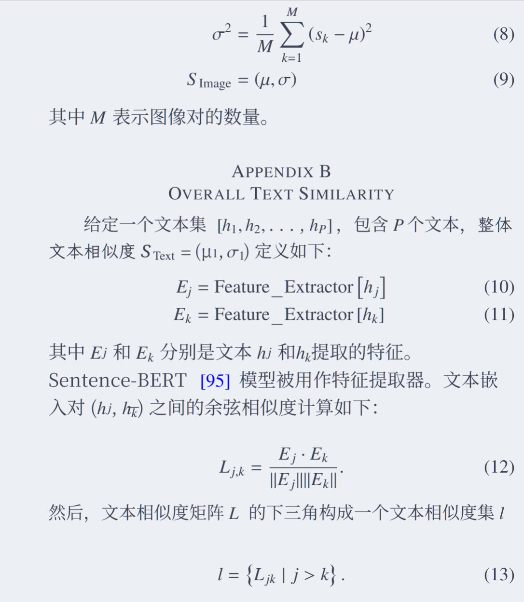

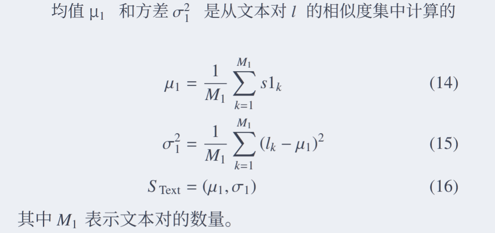

在这篇文献中，我初步了解到除了光学图像处理之外的SAR图像，以及VLMs在这方面存在的发展潜力。以及对于数据集的处理，通过几个数据集的合成，模态迁移的方式等，获取到自己想要的数据集，再进行人工筛选优化。

对于大模型如何看SAR图像，可以利用三种方式，直接问（零样本）、全部参数都训练（全微调）、只训练一小部分参数（LoRA），利用这些方式可以去调试模型更加匹配任务。

模型的任务执行的评价标准， BLEU、ROUGE、CIDEr，以及GPT-4 打分和 CHAIR2，可以去更加全面评判模型优劣

## 二、GeoChat: Grounded Large Vision-Language Model for Remote Sensing

- **作者**：Kartik Kuckreja, Muhammad Sohail Danish, Muzammal Naseer, Abhijit Das, Salman Khan, Fahad Shahbaz Khan
- **单位**：Mohamed bin Zayed University of AI、BITS Hyderabad、Australian National University、Linkoping University
- 2023.11.24
- **核心关键词**：Remote Sensing、Vision-Language Model、Grounded Conversation、Instruction Tuning、LoRA、Visual Grounding
- 遥感图像理解、视觉语言模型、多模态对话、视觉定位
- 阅读时间：2026.9.24

### 第一章提出背景： 通用 VLM 的成功与不足

自然图像领域，GPT-4、LLaVA、MiniGPT-4 等视觉语言模型通过大规模图文预训练和指令微调，具备较强零样本多模态对话能力。但这些通用模型在遥感场景中表现差，容易产生不准确信息或幻觉。

主要存在问题：

分辨率高，尺度变化大，小目标多。需要区域级推理，而不仅是整图理解。缺乏遥感领域多模态指令跟随数据。缺乏强遥感骨干模型，导致模型难以对齐用户查询。

### 第二章相关工作

遥感领域的 VLM 研究相对稀疏，已有工作多针对单一任务，如图像描述、零样本分类和视觉问答，缺乏对话能力和通用语义理解。RSGPT 是早期尝试，能进行对话并处理多任务，但每个任务仍需单独微调，且不支持区域级推理和视觉 grounding，通用性和可扩展性有限。

#### GeoChat 

单个流程中统一多个图像和区域级推理任务支持三类任务：

**图像级对话**：图像描述、VQA、场景分类、多轮对话。

**区域级对话**：用户输入边界框，模型针对指定区域回答问题或生成描述。

**Grounded 对话**：模型在文本回答中插入物体位置，实现视觉定位。

### 第三章**GeoChat 架构**介绍

遵循LLaVA‐v1的架构,它由三个核心组件组成,全局图像编码器,一个MLP适配器 (两个线性层)和LLM。添加了特定的任务提示，以指示模型所需的任务类型, 即接地、图像级或区域级对话。

任务token

轻松切换不同类型的遥感视觉解释任务，t ∈ {grounding, identify, refer},分别用于基于实体的对话、区域标题和指代表达理解

空间位置表示

精确地识别引用项的空间位置,以用于基于实体的对话、指代表达生成和理解等任务。将框位置以文本格式表 示,以表达地理位置:b = {bx 左侧 by 顶部 bx 右侧 by 底  部|θ}。在这里,bx 左侧、by 顶部表示框的左上角点,而 bx 右侧 、by 底部表示右下角坐标。角度 θ 表示边界框从下边缘的旋转角度。

视觉主干

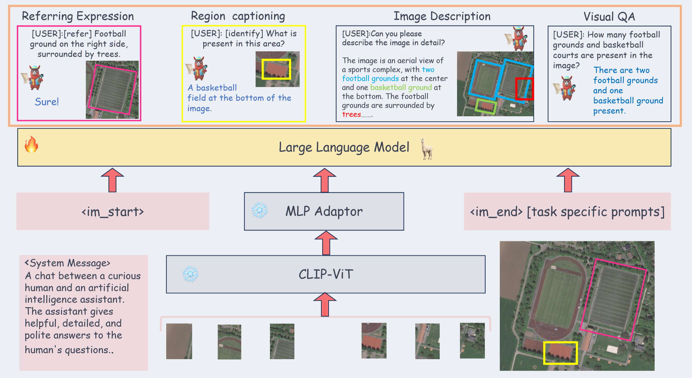

### 第四章数据集构造

整合了三种不同类型的数据集,包括为对象检测、场景分类和视觉问答(VQA)设计的数据集。

目标检测：SAMRS，由 DOTA、DIOR、FAIR1M 组成，提供边界框和类别；

场景分类：NWPU-RESISC-45；

VQA：LRBEN；

洪水检测 VQA：FloodNet

详细描述、多轮对话、复杂问答、场景分类、遥感 VQA、grounding 描述、区域描述和 referring expression，基本囊括了图像级、区域级和 grounding 三类主要任务。

**生成流程**

核心思路是从检测框提取物体属性，包括类别、颜色、相对大小、相对位置和物体关系，再用模板生成指代表达，最后用 Vicuna-v1.5 扩写出多轮对话、复杂问题和详细描述。对于检测数据中缺失的建筑、道路、树等类别，用 ViTAE-RVSA 在 LoveDA 上预训练后做伪标签补充，并去掉与已有标注重叠的预测以减少噪声。

**从检测框提取属性 → 模板生成指代表达 → LLM 扩写对话和问答**。

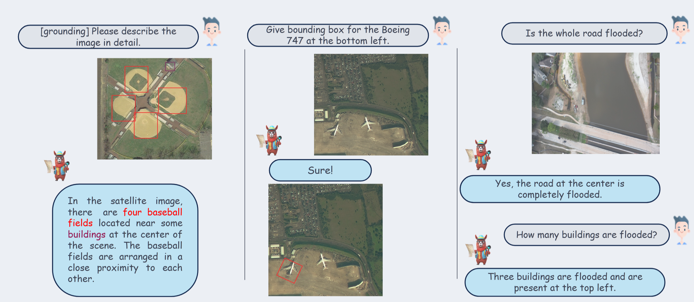

### 第五章实验与结果

**场景分类**

GeoChat 的零样本性能显著优于其他通用视觉语言模型，在 AID 和 UCMerced 两个数据集上都取得了最高准确率。GeoChat 具备较强的零样本遥感场景分类泛化能力，但这一优势主要体现在常见场景类别上

**视觉问答 VQA**

GeoChat 整体表现明显优于通用视觉语言模型，在低分辨率遥感问答上已接近专门微调的专家模型；在高分辨率问答中，它在比较类问题上优势突出，但存在性判断反而偏弱，暴露出小目标和复杂场景下的感知不稳定性。总体来看，GeoChat 的 VQA 综合能力最强

**视觉 grounding**

整体性能仍较低，尤其小目标和多目标场景。GeoChat 在中型目标上优于 MiniGPT-4-v2

模型在小对象上或需要预测多个边界框时性能较低，中等尺寸图像上表现更好，作为多个边界框生成的 IoU 以及生成的文本答案，模型提供了更好的描述,其边界框准确率略优于 MiniGPT‐4‐v2

### 第六章结论分析

GeoChat不仅回答图像级查询,还参与特定 区域的对话,用精确的空间坐标来定位响应

## 两篇文献对比：

- **GeoChat**：提出首个**统一的多任务遥感VLM**，强调**视觉定位**与**区域级对话**能力，并构建了**318k指令数据集**。
- **SARLANG-1M**：构建了**百万级SAR图像-文本数据集**，专注于**SAR图像理解**，并系统评估了VLM在SAR任务上的表现。

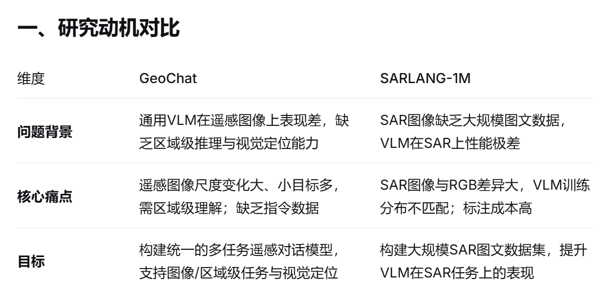

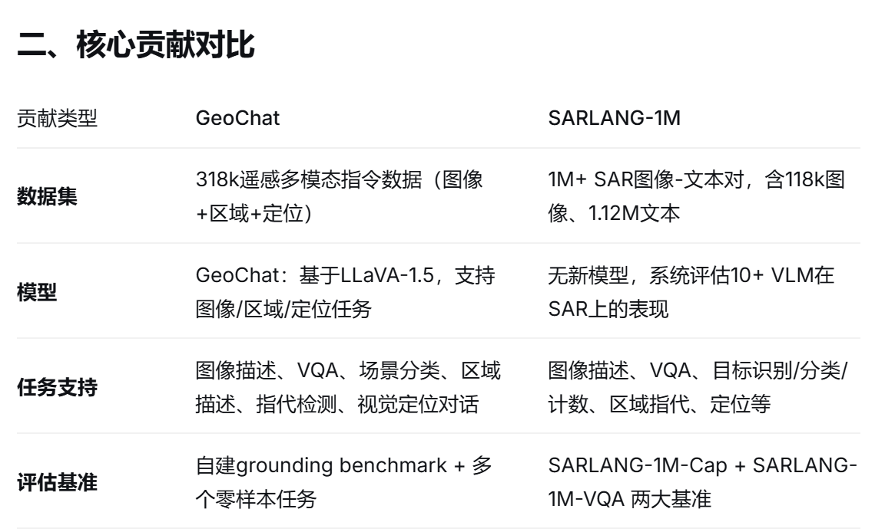

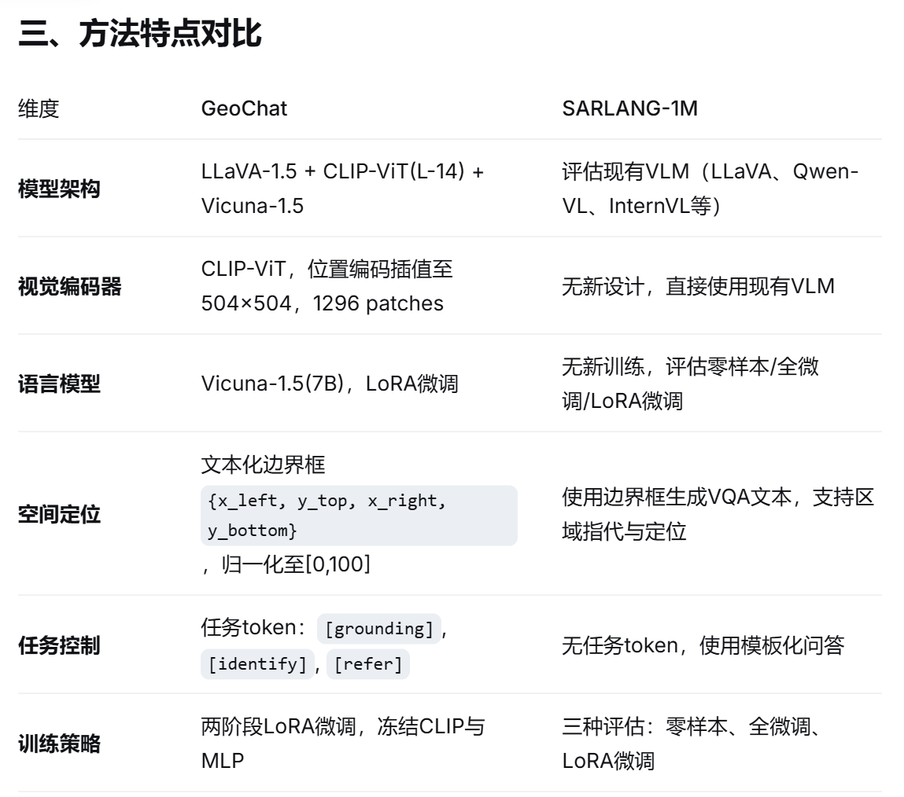

提出问题，目前方法，模型框架，数据集，实验

数据集：提出数据集缺陷，当前数据集，如何制作新的数据集指标

两篇都是遥感 VLM 方向的重要工作。SARLANG-1M 补上了 SAR 多模态数据的空白，GeoChat 补上了遥感统一对话和 grounding 的空白。：SARLANG-1M 是面向 **SAR 图像理解的大规模图文基准数据集**；GeoChat 是面向 **光学遥感图像的多任务、可视觉定位对话 VLM 模型**

下期任务计划阅读文献：

1、EmbodiSkill: Skill-Aware Reflection for Self-Evolving Embodied Agents

2、Self-Evolving Embodied Agents via Skill-Harness  Evolution